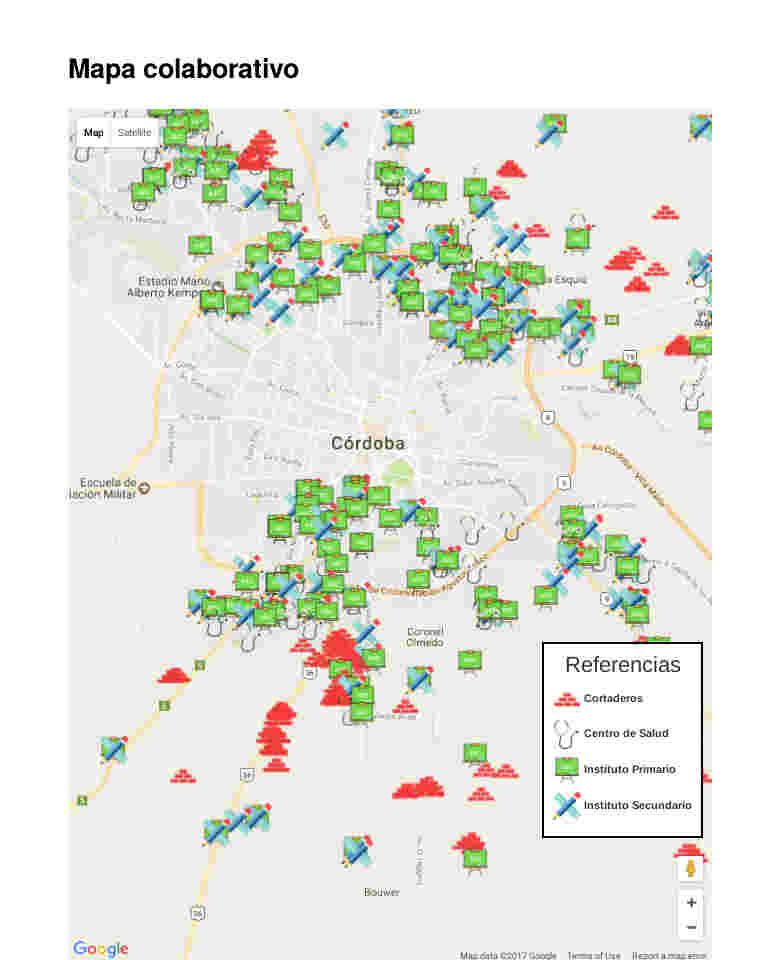
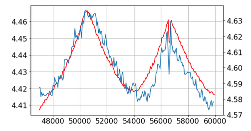

# Pewen
Matemática & TIC
   

> Presentación

# Curriculum
Sólida formación en Física y Matemática 
Análisis de grandes cantidades de datos 
Programación científica 
Ciencia de Datos y Machine Learning 
Visualización de datos 

# Áreas de trabajo
 Modelado matemáticos, análisis de datos 
 Generar el modelo matemático desde cero 
 Implementación computacional 
 Optimización computacional 
 Implementación y análisis de machine learning 
 Automatización de procesos repetitivos 
 Visualización 
 Procesamiento de imágenes satelitáles 
 GUI HTML5

# Tecnologías
 Python, Lua, Fortran 
 D3 - JavaScript 
 Docker 
 GNU/Linux 
 Machine learning 
 NoSQL database 
 Time Series database 
 Analytics and monitoring 
 Geographic information system

# Algunos proyectos

# Unsteady Vortex Lattice Method
UVLM es un código desarrollado en Fortran para hacer simulaciones de perfiles alares. El problema principal era el tiempo de la simulación.

Originalmente tardaba 1 semana. Luego de optimizaciones matemáticas y numéricas tarda 3 horas. Corre en 80 cores.

# TEN - Simulaciones cuánticas
Software para análisis cuánticos químicos. Desarrollo del modelo matemático y la implementación numérica para correr en cluster.

[https://github.com/pewen/ten](https://github.com/pewen/ten) 
[XVII Giambiagi Winter School. Light and light-based technologies](https://github.com/pewen/ten.extras/raw/master/2015_Giambiagi/poster_Giambiani.compressed.pdf), dpto de Física, UBA

# 

# Mapeo interactivo y análisis de Cortaderos de Ladrillos
Desarrollo de una aplicación web para mapeo colectivo. Además se cruzaron datos con los del censo nacional para crear gráficos de las distribuciones de acceso a diferentes servicios básicos desde los cortaderos.

[Muertes infantiles y marginalidad detrás de los ladrillos cordobeses]( https://www.chequeado.com/investigacion/muertes-infantiles-y-marginalidad-detras-de-los-ladrillos-cordobeses/)

# 

# Observatorio de corrupción
Mostrar datos públicos del Estado. Diariamente se scrapea el [Centro de Información Judicial](http://www.cij.gob.ar) para analizarlo y generar una interfaz gráfica.

+5000 PDFs para extraer información 
Scraping diario de +500 causas 
Visualizaciones automáticas con nuevos datos  
[Observatorio de Causas de Corrupción](http://conocimientoabierto.org/observatorio-corrupcion/)

# Quiniela Judicial. Entendiendo el sistema de asignacion de causas

Las denuncias que generan una causa en la justicia federal se sortean a través de un programa informático para determinar el juzgado. Este sorteo debería ser “automático e igualitario”. Sin embargo, la aleatoriedad e independencia de este sistema de sorteos ha sido frecuentemente cuestionada.

[Quiniela Judicial](https://conocimientoabierto.github.io/visualizaciones/sorteosJudiciales/) 
[DATA SCIENCE: La lupa en la Justicia](http://blogs.lanacion.com.ar/data/entrevistas/data-science-franco-bellomo-pone-la-lupa-en-la-justicia/)

# Socios.red
Visualización de las relaciones del poder económico de Argentina
1 millón de empresas 
2 millones de personas 
Funcionarios públicos 
60 mil aportes a campañas políticas 
Compras del Estado   
[socios.red](https://secret-device-211719.appspot.com/)

# AMBA en datos
+400 bases de datos 
distintos tipos de datos georeferenciados: puntos, líneas, polígonos, municipios 
plots multi capa sobre el mapa y gráficos adicionales como treemap y bar plots 
interfaz web mobile responsible

# 

# 

# Taller de Matemática Industrial
A partir de los datos que releva [Aluar](https://www.aluar.com.ar/) en las cubas de producción de aluminio generamos un modelo matemático y numérico para simular el consumo de alumita.

[Taller de Matemática Industrial 2018](http://mate.dm.uba.ar/~tami2018/), Exactas, UBA

# 
Simulación de consumo de alumita en cuba de producción 
azul: curva real 
roja: curva simulada

# Workshops
[Tercer Escuela Argentina de GPGPU Computing para Aplicaciones Científicas](http://fisica.cab.cnea.gov.ar/gpgpu/index.php?option=com_content&view=article&id=37&Itemid=11&lang=es), Instituto Balseiro 
[Advanced Techniques for Scientific Programming](http://indico.ictp.it/event/a14258/), International Centre for Theoretical Physics, Brazil 
[Astro Hack Week 2016](http://astrohackweek.org/2016/), University of California Berkeley  

## Curso dictado
[Programación Científica en Python](https://pewen.tk/wpc/), Departamento de Ciencias de la Atmósfera y los Océanos, Exáctas, UBA

# Premios y reconocimientos
NASA Space Apps Challenge: Best Mission Concept, “Piratas de Cascotes”, Bs As 
NASA Space Apps Challenge: [Pollen Alert](https://youtu.be/9M91NDIaKHo) - Global Winner 
“Predicción de Clicks”, 1er puesto. [Jampp](https://jampp.com/) y [Programa de Ciencia de Datos de Fundación Sadosky](http://www.fundacionsadosky.org.ar/programas/pcd/) 
[Hackaton Agro Datos](http://www.fundacionsadosky.org.ar/agrodatos/), 3er puesto, “Germineitor”, FaMAF, Córdoba. [Programa de Ciencia de Datos de Fundación Sadosky](http://www.fundacionsadosky.org.ar/programas/pcd/)
