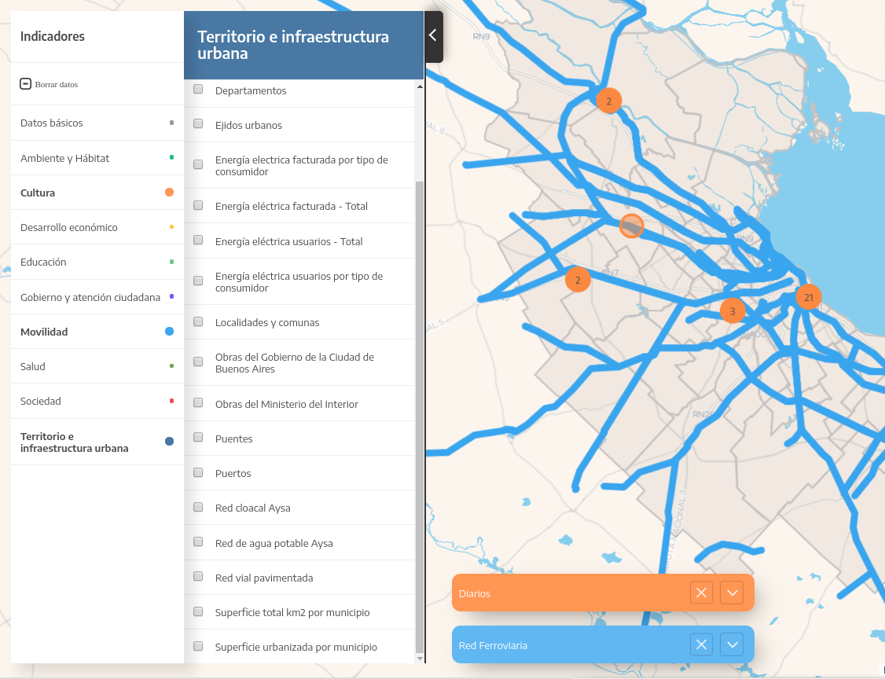

# Pewen
Combinando matemática y TIC
  

> Presentación para Rakiduamn

# Curriculum
Formación en Física y Matemática 
Análisis de grandes cantidades de datos 
Programación científica 
Ciencia de Datos y machine learning 
Visualización de datos 

# Áreas de trabajo
 Modelado matemáticos, análisis de datos 
 Generar el modelo matemático desde cero 
 Implementación computacional 
 Optimización computacional 
 Implementación y análisis de machine learning 
 Automatización de procesos 
 Visualización 
 GUI con HTML5

# Tecnologías
 Python, Lua y C 
 D3 - JavaScript 
 Docker 
 GNU/Linux 
 machine learning 
 NoSQL database

# Algunos proyectos

# UVML - Simulación de perfiles alares
UVML es un código desarrollado para hacer simulaciones de perfiles alares. El problema principal era el tiempo de la simulación.

Originalmente tardaba 1 semana. Luego de optimizaciones matemáticas y numéricas tarda 3 horas. Corre en 80 cores.

# TEN - Simulaciones cuánticas
Software para análisis cuánticos químicos. En este caso desarrollamos el modelo matemático y la implementación numérica para correr en cluster.

[https://github.com/pewen/ten](https://github.com/pewen/ten) 
[XVII Giambiagi Winter School. Light and light-based technologies](https://github.com/pewen/ten.extras/raw/master/2015_Giambiagi/poster_Giambiani.compressed.pdf), dpto de Física, UBA

# Observatorio de corrupción
En este proyecto la idea es mostrar datos públicos del Estado. Todos los días scrapeamos http://www.cij.gob.ar para luego analizarlo y generar una interfaz gráfica.

más de 5000 PDFs para extraer información 
Scrapeo diario de 500 causas 
Visualizaciones automáticas con nuevos datos 
[Observatorio de Causas de Corrupción](http://conocimientoabierto.org/observatorio-corrupcion/)

# Socios.red
1 millón de empresas 
2 millones de personas 
Funcionarios públicos 
60 mil aportes a campañas políticas 
Compras del Estado  
[socios.red](https://secret-device-211719.appspot.com/)

# AMBA en datos
más de 400 bases de datos 
distintos tipos de datos georeferenciados: puntos, líneas, polígonos, municipios 
plots multi capa sobre el mapa y gráficos adicionales como treemap y bar plots 
interfaz web mobile responsible

# 

# 

# Taller de Matemática Industrial
A partir de los datos que releva ALUAR en las cubas de producción de aluminio generamos un modelo matemático y numérico para simular el consumo de aluminita

[Taller de Matemática Industrial 2018](http://mate.dm.uba.ar/~tami2018/), Exactas, UBA

# 

# Workshops
[Advanced Techniques for Scientific Programming](http://indico.ictp.it/event/a14258/), Brazil 
[Astro Hack Week 2016](http://astrohackweek.org/2016/), Berkeley, CA  

## Curso dictado
[Programación Científica en Python](https://pewen.tk/wpc/), Departamento de Ciencias de la Atmósfera y los Océanos, Exáctas, UBA

# Premios y reconocimientos
NASA Space Apps; Best Mission Concept, “Piratas de Cascotes”, Bs As 
NASA Space Apps: [Pollen Alert](https://youtu.be/9M91NDIaKHo) - Global Winner 
“Predicción de Clicks”, 1er puesto. [Jampp](https://jampp.com/) y [Programa de Ciencia de Datos de Fundación Sadosky](http://www.fundacionsadosky.org.ar/programas/pcd/) 
[Hackaton Agro Datos](http://www.fundacionsadosky.org.ar/agrodatos/), 3er puesto, equipo “Germineitor”, FaMAF, Córdoba
